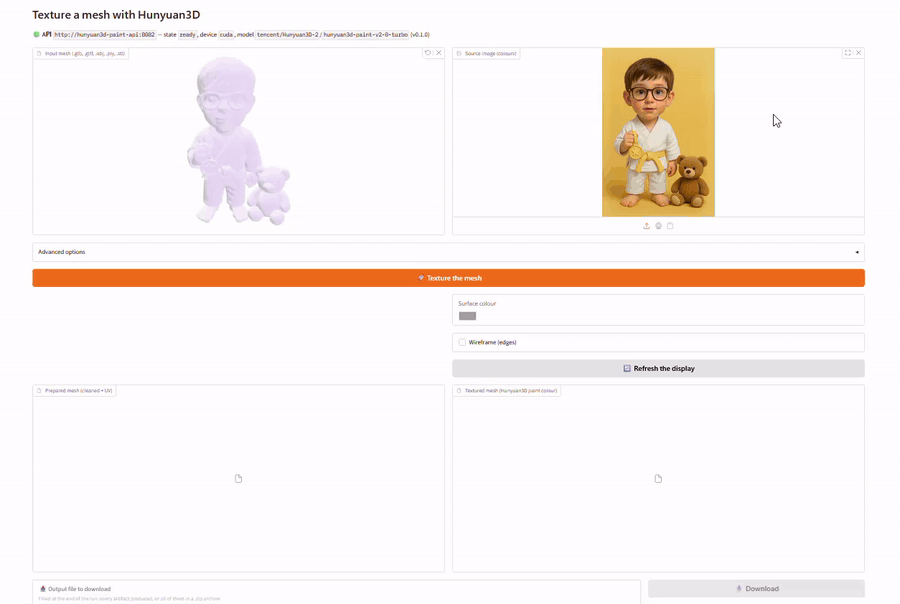

# Hunyuan3D Paint — Texture API

Paints an existing 3D mesh with the colours of a reference image, using Tencent's
**hunyuan3d-paint-v2-0-turbo** texture model. It is the *texture* half of the
Hunyuan3D pipeline, on its own: a mesh file and a photo in, a textured **GLB**
out.

```
POST /api/v1/texture   (multipart: mesh + image + options)
  → mesh cleanup, Taubin smoothing, decimation      → <key>_mesh_prepared.glb
  → UV unwrap (xatlas) when the mesh has no atlas
  → Hunyuan3D paint (delight → 6 views → bake)      → <key>_mesh_textured.glb
  → JSON with sizes, sha256 and download URLs
```

The service is **decoupled from mesh generation**. It does not know how the
geometry was produced and never calls the shape model: hand it a
[Hunyuan3D](https://github.com/Tencent-Hunyuan/Hunyuan3D-2) shape output, a
scanned model, or something out of Blender. That is also what keeps this image
free of the shape checkpoint.

> **GPU note.** The full-resident set is ~8 GB of fp16 weights (multiview
> pipeline ~5.3 GB + delight ~2.2 GB + renderer and CUDA context ~0.7 GB), so
> this service normally wants a **9 GB+ card**. On a smaller one, set
> `H3D_LOW_VRAM=1` to build the pipelines CPU-first and stream the weights
> from system RAM — see [Running on a small GPU](#running-on-a-small-gpu).

---

## Demo



---

## Quick start

```bash
cp .env.example .env          # optional, every value has a default
docker compose up --build -d
docker compose logs -f        # first start downloads ~14 GB of weights
```

The API is then on `http://localhost:8082` — **interactive docs at `/docs`**,
OpenAPI schema at `/openapi.json`, liveness at `/health`, readiness at `/ready`
— and the front-end at `http://localhost:7861`.
`docker compose up -d hunyuan3d-paint-api` starts the API alone.

Requirements: an NVIDIA driver with the container toolkit (`nvidia-smi` must
work), ~25 GB of free disk for the image plus the checkpoints, and host RAM for
the load (see [Memory](#memory)). The default torch build targets CUDA 13
(`cu130`, driver ≥ 580); change `TORCH_INDEX_URL` in `.env` for another driver.

### Use it

```bash
# paint a mesh with a photo; the response carries every artifact and its URL
curl -s -X POST http://localhost:8082/api/v1/texture \
     -F "mesh=@chair_mesh_processed.glb" \
     -F "image=@chair.png" | jq

# fetch the result
curl -O http://localhost:8082/api/v1/texture/jobs/chair_mesh_chair/files/chair_mesh_chair_mesh_textured.glb

# re-run instead of reusing the cached artifacts
curl -s -X POST http://localhost:8082/api/v1/texture \
     -F "mesh=@chair_mesh_processed.glb" -F "image=@chair.png" \
     -F "reuse_cached=false"

# list / inspect / delete jobs
curl -s http://localhost:8082/api/v1/texture/jobs | jq
curl -s http://localhost:8082/api/v1/texture/jobs/chair_mesh_chair | jq
curl -s -X DELETE http://localhost:8082/api/v1/texture/jobs/chair_mesh_chair -o /dev/null -w '%{http_code}\n'
```

A run takes tens of seconds to a few minutes depending on `texture_size`,
`target_faces` and the card — **tens of minutes** with `H3D_LOW_VRAM=1`,
where every diffusion step shuttles weights over PCIe. Either way, give
clients a generous timeout.

---

## Front-end Gradio

`hunyuan3d-paint-ui` is a pure client of this API: the mesh picker is itself a
3D window — an interactive `Model3D` that shows the file as soon as it is
dropped in it — so the **input mesh** appears where it was uploaded, next to the
source image. The run then ends on the **prepared mesh** next to the
**textured result**, with the paint options, a download picker and a journal of
the run. It holds no model (no torch, no CUDA), so it runs anywhere that can
reach the API.

```bash
docker compose up -d --build      # API + front-end
docker compose logs -f hunyuan3d-paint-ui
# then open http://localhost:7861
```

| variable | default | purpose |
|---|---|---|
| `H3D_UI_API_URL` | `http://hunyuan3d-paint-api:8082` | API to drive (a compose service name, or `http://gpu-box:8082`) |
| `H3D_UI_PORT` | `7861` | published port |
| `H3D_UI_TIMEOUT_S` | `1800` | HTTP read timeout — must outlast a paint run |
| `H3D_UI_DATA_DIR` | `/data/ui` | where the meshes it displays are kept |

---

## API

| method | path | purpose |
|---|---|---|
| `POST` | `/api/v1/texture` | mesh + image → textured GLB; blocks until the artifacts are on disk |
| `GET` | `/api/v1/texture/jobs` | recent jobs (`limit`, `offset`) |
| `GET` | `/api/v1/texture/jobs/{job_id}` | the stored result payload of one job |
| `GET` | `/api/v1/texture/jobs/{job_id}/files/{filename}` | download an artifact |
| `DELETE` | `/api/v1/texture/jobs/{job_id}` | delete the job and its artifacts |
| `GET` | `/api/v1/info` | defaults, limits, model state (including the memory mode) |
| `GET` | `/health` | liveness (200 as soon as the process is up) |
| `GET` | `/ready` | readiness (503 until the weights are loaded) |

Errors always use the same envelope:

```json
{ "error": { "code": "insufficient_vram", "message": "...", "details": { "required_gb": 3.0 } } }
```

Status codes: `413` upload too large, `415` unsupported mesh or image, `422`
invalid parameter or unreadable mesh, `500` paint/preprocessing failure
(`host_out_of_memory` when the *system* RAM ran out), `503` `insufficient_vram`
or the model is unavailable, `404` unknown job or artifact.

### `POST /api/v1/texture`

Multipart form with **two** required files. Every other field falls back to the
`H3D_DEFAULT_*` settings, which is why `/api/v1/info` is the authoritative place
to read the defaults.

| field | default | meaning |
|---|---|---|
| `mesh` | — | the geometry (`.glb .gltf .obj .ply .stl`) |
| `image` | — | the reference photo (`.png .jpg .jpeg .webp .bmp`) |
| `texture_size` | `768` | bake *and* render resolution — the main memory knob at run time |
| `target_faces` | `50000` | decimation budget, `0` keeps every face |
| `taubin_steps` | `20` | Taubin smoothing iterations (`0` disables) |
| `taubin_lambda` / `taubin_mu` | `0.5` / `-0.53` | Taubin coefficients |
| `uv_unwrap` | `true` | run xatlas when the mesh has no UV atlas |
| `seed` | `0` | the multiview diffusion seed; `-1` draws a fresh one per job |
| `reuse_cached` | `true` | reuse the artifacts already on disk for this pair |

The **job key is built from both upload names** (`<mesh>_<image>`), so painting a
second photo onto the same mesh is a different job — otherwise the cache would
serve the first texture forever.

`texture_size` drives the whole texture pass, not just the atlas: the six
normal/position renders, the multiview images the bake back-projects and the
baked UV atlas are all generated at that resolution (upstream fixes all of them
at 2048 and takes no resolution argument at all, which is why the vendored
`hy3dgen` carries the fork the engine pushes the value into). Lowering it is
therefore the real VRAM knob, at the price of a coarser texture.

`seed` reaches the multiview diffusion pipeline. A fixed value makes a run
reproducible; `-1` draws a fresh seed per job, so two runs on the same pair of
uploads give two textures. `H3D_DEFAULT_SEED` sets the fallback for jobs that
omit the field (upstream hardcodes 0 and exposes nothing).

**Preparation order matters**: clean → smooth → decimate → unwrap. Decimation
invalidates UV seams, and smoothing a decimated mesh moves its collapse
artefacts, so the unwrap has to come last. STL cannot carry UVs, so a prepared
mesh with an atlas is always written as `.glb`.

### Response (abridged)

```json
{
  "job_id": "chair_mesh_chair",
  "job_key": "chair_mesh_chair",
  "status": "succeeded",
  "duration_s": 96.4,
  "device": "cuda",
  "reused_cache": false,
  "input_mesh":  { "filename": "chair_mesh_chair_mesh_src.glb", "size_bytes": 5120344, "sha256": "…", "url": "…" },
  "input_image": { "filename": "chair_mesh_chair_image_src.png", "size_bytes": 812345, "sha256": "…", "url": "…" },
  "prepared_mesh": { "filename": "chair_mesh_chair_mesh_prepared.glb", "size_bytes": 2480120, "sha256": "…", "url": "…",
                     "stats": { "faces": 50000, "vertices": 25012, "extents": [1.01, 0.43, 0.97], "watertight": true } },
  "mesh": { "filename": "chair_mesh_chair_mesh_textured.glb", "size_bytes": 3900112, "sha256": "…", "url": "…",
            "stats": { "faces": 50000, "vertices": 25012, "extents": [1.01, 0.43, 0.97], "watertight": true } },
  "uv": { "unwrapped": true, "had_uvs": false, "smoothed": true, "faces_before": 483210, "faces_after": 50000 },
  "parameters": { "texture_size": 768, "target_faces": 50000, "…": "…" },
  "files": { "chair_mesh_chair_mesh_textured.glb": "…", "chair_mesh_chair_mesh_prepared.glb": "…" }
}
```

`mesh` is the textured result — a GLB, so the texture travels with it. `uv`
reports what the preparation actually did, not what was requested:
`smoothed` is the outcome of the Taubin pass, so a `scipy` import that failed
shows up as `false` rather than as a silent quality loss.

---

## Output layout

```
<H3D_OUTPUT_DIR>/<job_key>/
├── <job_key>_mesh_src<ext>        # the uploaded geometry, copied in
├── <job_key>_image_src<ext>       # the uploaded photo
├── <job_key>_image_processed.png  # the RGBA image the model actually saw
├── <job_key>_mesh_prepared.glb    # cleaned + smoothed + decimated + unwrapped
├── <job_key>_mesh_textured.glb    # the result
└── job.json                       # last response payload, serves GET /jobs/{id}
```

---

## Memory

Two budgets have to be satisfied, and they fail differently.

### Host RAM

The checkpoints are ~7.5 GB of fp16 weights (a ~14 GB download: the repo ships
each file both as an fp32 `.bin` and as fp16 safetensors) and are read into
**system** memory before anything reaches the GPU — and with `H3D_LOW_VRAM=1`
they *stay* there — so a container with less than `H3D_MIN_HOST_RAM_GB` is
OOM-killed mid-load and the client only sees a dropped socket, which says
nothing about the real cause. The guard compares against **reachable** memory:
free RAM plus free swap, but only when the container is allowed to swap.

That last part is the trap. Docker maps `mem_limit`/`memswap_limit` onto the
cgroup's `memory.max` and `memory.swap.max`, and **`memswap_limit == mem_limit`
sets `memory.swap.max` to 0** — swapping disabled for the container. The load
then dies at the RAM ceiling with the swap file sitting empty right next to it,
which looks identical to having no swap at all. Keep the swap limit well above
the RAM limit:

```yaml
mem_limit: ${H3D_MEM_LIMIT:-15g}          # -> memory.max
memswap_limit: ${H3D_MEMSWAP_LIMIT:-31g}  # -> memory.max + memory.swap.max
```

Confirm it took effect before trusting it — `memory.swap.max` must be non-zero:

```bash
docker exec hunyuan3d-paint-api cat /sys/fs/cgroup/memory.swap.max
```

If a load does get killed, the kernel log is where it appears. With Docker
Desktop the container runs in its own VM, so Ubuntu's `dmesg` stays clean:

```bash
wsl -d docker-desktop -- dmesg | grep -iE 'oom|killed process' | tail
```

### Running on a small GPU

By default the vendored constructors move each whole pipeline onto the card
during `from_pretrained` (`pipeline.to("cuda")`), so what has to fit is the
**entire ~8 GB resident set**: multiview pipeline ~5.3 GB, delight ~2.2 GB,
renderer and CUDA context ~0.7 GB. A 6 GB card cannot hold it, however much
system RAM the host has and however small `texture_size` gets — the weights
themselves have to fit.

**`H3D_LOW_VRAM=1` changes that constraint rather than working around it**, and
three things make it work — all of which separate it from upstream's
`--low_vram_mode`:

1. **The pipelines are built CPU-first.** The service sets
   `HY3DGEN_TEXGEN_DEVICE=cpu` *before* `from_pretrained`, so the vendored
   constructors' own `.to(self.device)` lands on the CPU. Without this,
   construction itself moves the whole model onto the card and a 6 GB GPU
   dies before any offload hook can run.
2. **The offload is sequential, not model-level.** Upstream's
   `enable_model_cpu_offload` keeps each *whole* model in system RAM and
   moves it onto the card when its turn comes — which still requires the
   5.3 GB multiview pipeline to fit in one piece. `enable_sequential_cpu_offload`
   (added to the vendored fork) moves one sub-module at a time, the only
   granularity a 6 GB card can take.
3. **The weights the pipeline reads outside a forward pass are buffers.**
   Sequential offload leaves every *parameter* on the `meta` device between
   forwards, and the multiview pipeline reads `unet.learned_text_clip_gen` to
   build `prompt_embeds` *before* the UNet is entered — so the read came back
   dataless (`Cannot copy out of meta tensor; no data!`, twenty minutes into
   the run). Registering those two embeddings as buffers, which accelerate
   keeps resident at `offload_buffers=False`, is what makes them readable.

What has to fit is then the largest single block plus the renderer, the CUDA
context and the activations — ~2–2.5 GB — which is what `H3D_MIN_VRAM_LOW_GB`
(default `3`) enforces.

| | resident VRAM | speed | host RAM |
|---|---|---|---|
| `H3D_LOW_VRAM=0` (default) | the whole ~8 GB set | fast | checkpoint resident during load |
| `H3D_LOW_VRAM=1` | ~2–2.5 GB | tens of minutes per texture — weights cross PCIe at every diffusion step | checkpoint stays resident |

The two budgets are **separate settings**, not one value with a factor:
offloading changes what is resident, so `H3D_MIN_VRAM_GB` is ignored while
`H3D_LOW_VRAM=1` and `H3D_MIN_VRAM_LOW_GB` applies instead. The low-VRAM guard
is not zero-able for free either — the offload moves the *weights*, not the
renderer, the CUDA context or the activations.

Movement in both directions is possible without a restart, but the load has to
be redone either way:

```bash
# .env
H3D_LOW_VRAM=1
H3D_MIN_VRAM_LOW_GB=3
H3D_MIN_HOST_RAM_GB=14      # still required: the checkpoint lives in RAM
```

Verify the mode took effect — `/api/v1/info` reports it, so you do not have to
read the container's environment:

```bash
curl -s http://localhost:8082/api/v1/info | jq '.model | {low_vram, vram_required_gb, device, state}'
```

---

## Configuration

Everything is read from `H3D_*` environment variables (`.env` works too); see
`.env.example` for the annotated list. The ones that matter most:

| variable | default | purpose |
|---|---|---|
| `H3D_MODEL_ID` / `H3D_MODEL_SUBFOLDER` | `tencent/Hunyuan3D-2` / `hunyuan3d-paint-v2-0-turbo` | the texture model |
| `H3D_DEVICE` | `auto` | paint **requires** CUDA — its rasterizer has no CPU path |
| `H3D_PRELOAD_MODEL` | `0` | load the weights at startup instead of on the first request |
| `H3D_MAX_CONCURRENT_JOBS` | `1` | in-flight jobs before requests queue (one GPU!) |
| `H3D_MAX_MESH_UPLOAD_MB` | `256` | mesh ceiling (a raw marching-cubes GLB can be 30–60 MB) |
| `H3D_MAX_UPLOAD_MB` | `32` | image ceiling |
| `H3D_MIN_HOST_RAM_GB` | `14` | system RAM the load needs; `0` disables the check |
| `H3D_MIN_VRAM_GB` | `9` | VRAM the full-resident load needs; `0` disables |
| `H3D_LOW_VRAM` | `0` | build CPU-first and stream the weights from system RAM (see above) |
| `H3D_MIN_VRAM_LOW_GB` | `3` | VRAM the low-VRAM mode needs; `0` disables |
| `H3D_DEFAULT_TEXTURE_SIZE` | `768` | bake resolution |
| `H3D_DEFAULT_TARGET_FACES` | `50000` | decimation budget |
| `H3D_MEM_LIMIT` | `7500m` | host-RAM ceiling of the container, so an OOM shows as `OOMKilled` |

---

## Running without Docker

```bash
python -m venv .venv && . .venv/bin/activate
pip install -r requirements.txt
pip install "torch==2.14.0" "torchvision==0.29.0" --index-url https://download.pytorch.org/whl/cu130
pip install --no-deps ./third_party/Hunyuan3D-2   # vendored hy3dgen

python scripts/download_models.py                 # ~14 GB, once
python main.py --reload                           # http://127.0.0.1:8082/docs
```

---

## Layout

```
app/
├── main.py                 FastAPI factory, lifespan (starts the model preload)
├── config.py               Settings from H3D_* (dependency-free)
├── schemas.py              the public request/response contract ⇒ OpenAPI
├── storage.py              job directories, uploads, safe artifact resolution
├── deps.py                 shared singletons as FastAPI dependencies
├── api/
│   ├── probes.py           /health, /ready
│   ├── errors.py           the JSON error envelope
│   └── v1/                 /info and the texture route
├── services/
│   ├── cuda.py             device state, VRAM reporting, host-OOM recognition
│   ├── paint.py            the paint pipeline, loaded once, lock-guarded
│   ├── mesh.py             load / clean / Taubin / decimate / UV unwrap
│   └── pipeline.py         the orchestration the endpoint exposes
ui/
├── app.py                  the Gradio UI and its event handlers
├── client.py               the API client (error envelope, URL re-anchoring)
├── viewers.py              trimesh helpers for the Model3D viewers
└── config.py               settings from H3D_UI_*
third_party/Hunyuan3D-2/    vendored upstream code (hy3dgen) + its license
docs/                       the demo GIF shown above
Dockerfile.ui · requirements-ui.txt   the front-end image (no torch, no CUDA)
tests/                      pytest suite
```

### Design notes

* **The paint model's extensions are compiled at image build time.** Unlike the
  shape model, paint needs two compiled pieces that `hy3dgen`'s own `setup.py`
  does not declare: `custom_rasterizer_kernel` (a CUDA extension) and
  `mesh_processor` (pybind11). The runtime image is a `python:3.13-slim` with no
  compiler, so a throw-away `nvidia/cuda:*-devel` stage builds them and only the
  artifacts are copied in; no GPU is needed for that.
* **`scipy` is a hard dependency, not an optional one.** `trimesh.smoothing`
  imports `coo_matrix` at module level; without scipy the Taubin pass is skipped
  with only a logged warning, so the mesh is exported raw — a silent quality
  loss rather than a crash. It is pinned for that reason.
* **`filter_taubin` takes `nu` as a positive magnitude.** The filter applies the
  sign itself (`vertices -= nu * dot`), so passing the published signed
  `mu = -0.53` straight through makes *both* passes shrink the mesh — a few dozen
  iterations on a low-poly mesh collapse it to a point. The call sites pass
  `abs(mu)`.
* **The UV unwrap runs last, and only when needed.** xatlas cuts the mesh open
  at seams, so a prepared mesh has more vertices than its input (an 8-vertex box
  becomes 24) — the geometry is rebuilt from `vmapping`/`indices` rather than
  patched. A mesh that already carries an atlas keeps it.
* **Paint failures raise rather than returning a partial result.** A caller asked
  for a texture; a 200 with an untextured mesh in it would be a lie. The error
  codes are distinct (`texture_failed`, `host_out_of_memory`,
  `insufficient_vram`) because the remedies are.
* **The GPU is taken once and held.** The checkpoint is loaded lazily on the
  first request (or at startup with `H3D_PRELOAD_MODEL=1`), behind a lock, and
  the start is non-blocking: `/health` answers immediately while `/ready`
  reports `loading`.

---

## Tests

```bash
pip install -r requirements-dev.txt
python -m pytest tests/ -q     # 111 tests, stubbed model, no GPU, no browser
```

Everything runs with `tests/stubs.FakePaintEngine` instead of the real model, so
the whole service is exercised without a GPU: uploads, mesh preparation, xatlas
unwrapping, both memory guards, the error envelope, caching, artifact serving,
and the front-end handlers.

---

## License

The code in this repository — `app/`, `ui/`, `scripts/`, `tests/`, `main.py`
and the Dockerfiles — is released under the **MIT License**:

```
Copyright (c) 2026 oLV - Olivier LAVAUD
```

See [`LICENSE`](LICENSE) for the full text.

`third_party/Hunyuan3D-2` (the vendored `hy3dgen` package) is **not** covered by
that license. It is distributed under the **Tencent Hunyuan Community License**
— see [`third_party/Hunyuan3D-2/LICENSE`](third_party/Hunyuan3D-2/LICENSE) and
[`third_party/Hunyuan3D-2/NOTICE`](third_party/Hunyuan3D-2/NOTICE) — and is
**non-commercial**: building and running this image pulls that checkpoint and
those terms apply to it.
